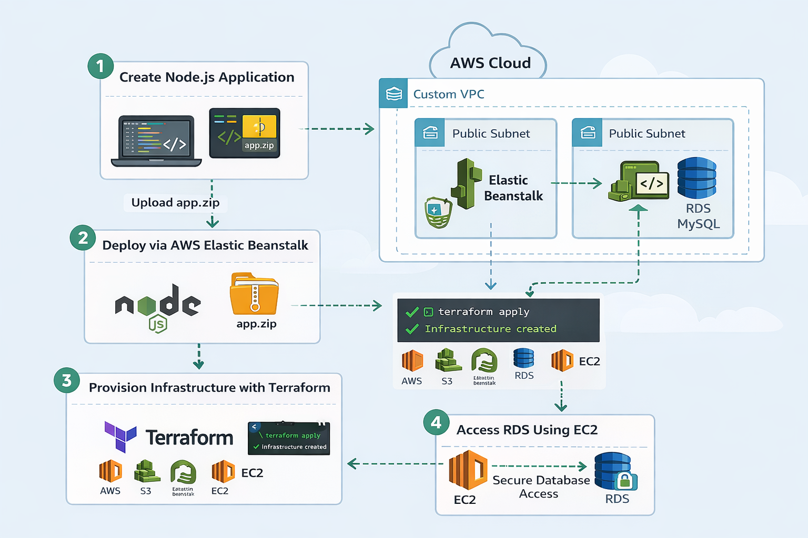
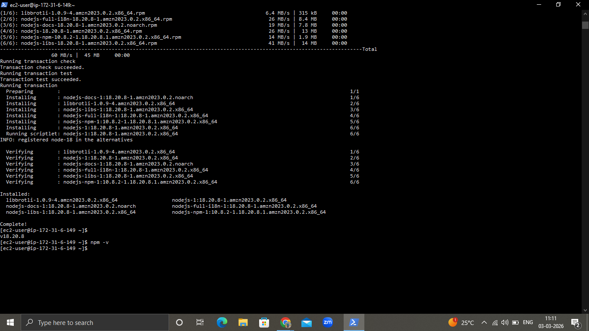
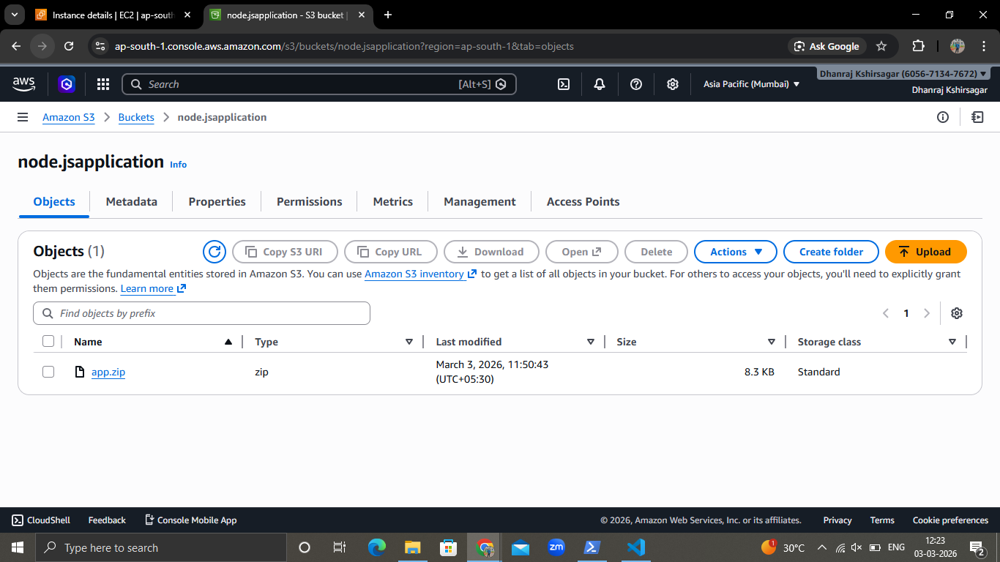
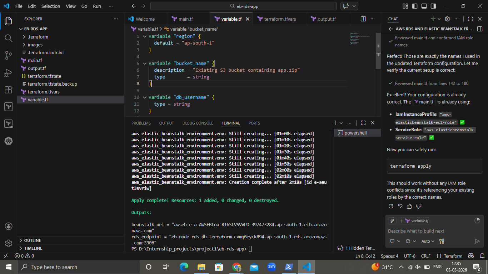
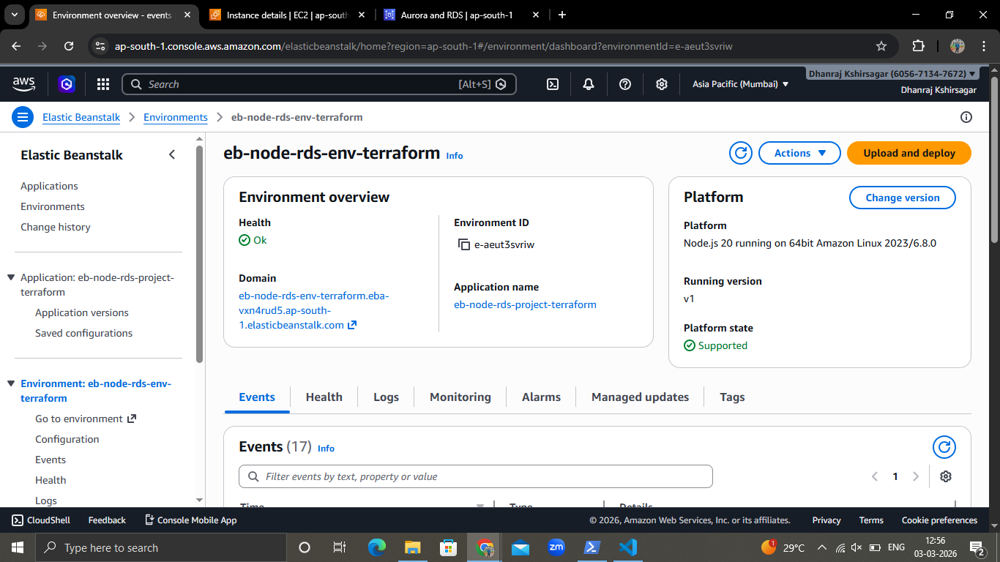
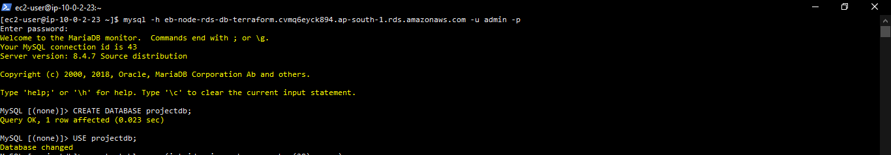
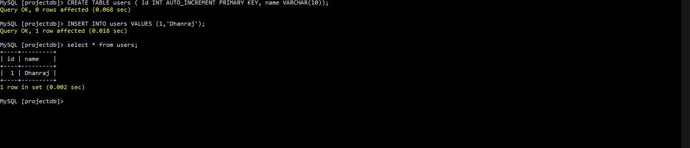

# 🚀 AWS Elastic Beanstalk + RDS Deployment using Terraform

## 📌 Project Overview

This project demonstrates how to deploy a Node.js application using AWS Elastic Beanstalk with an integrated Amazon RDS (MySQL) database, provisioned entirely using Terraform (Infrastructure as Code).

The project also includes secure database access from a separate EC2 instance within the same VPC.

---

## 🏗️ Architecture Diagram



### Architecture Workflow

1. Developer creates a Node.js application.
2. Application package (`app.zip`) is uploaded to Amazon S3.
3. Terraform provisions:
   - Custom VPC
   - Public subnets (Multi-AZ)
   - Internet Gateway
   - Route Tables
   - Security Groups
   - Amazon RDS (MySQL)
   - Elastic Beanstalk Application & Environment
4. Elastic Beanstalk pulls application from S3 and deploys it.
5. Separate EC2 instance connects securely to RDS within the same VPC.

---

## 🛠️ Technologies Used

- AWS Elastic Beanstalk
- Amazon RDS (MySQL)
- Amazon EC2
- Amazon S3
- VPC / Subnets / Security Groups
- Terraform (Infrastructure as Code)
- Node.js

---

## ⚙️ Step-by-Step Setup Guide

### Step 1: Create Node.js Application

```bash
mkdir eb-node-rds-project
cd eb-node-rds-project
npm init -y
npm install express
```

Create `app.js`:

```js
const express = require("express");
const app = express();
const PORT = process.env.PORT || 8080;

app.get("/", (req, res) => {
  res.send("Terraform Elastic Beanstalk + RDS Project Working!");
});

app.listen(PORT, () => {
  console.log(`Server running on port ${PORT}`);
});
```

Update `package.json`:

```json
"scripts": {
  "start": "node app.js"
}
```

Create application zip:

```bash
zip -r app.zip app.js package.json package-lock.json
```

---

### Step 2: Upload to Amazon S3

```bash
aws s3 mb s3://your-bucket-name
aws s3 cp app.zip s3://your-bucket-name/
```

---

### Step 3: Provision Infrastructure using Terraform

Initialize Terraform:

```bash
terraform init
```

Preview changes:

```bash
terraform plan
```

Apply infrastructure:

```bash
terraform apply
```

Terraform provisions:

* Custom VPC (Multi-AZ)
* Security Groups
* RDS MySQL Instance
* Elastic Beanstalk Application
* Elastic Beanstalk Environment
* Application Version from S3

---

### Step 4: Access RDS from Separate EC2

Launch EC2 in same VPC.

Install MySQL client:

```bash
sudo dnf install mariadb -y
```

Connect to RDS:

```bash
mysql -h <rds-endpoint> -u admin -p
```

Perform read/write test:

```sql
CREATE DATABASE projectdb;
USE projectdb;

CREATE TABLE users (
  id INT AUTO_INCREMENT PRIMARY KEY,
  name VARCHAR(100)
);

INSERT INTO users (name) VALUES ('Dhanraj');

SELECT * FROM users;
```

---

## 🔐 Security Considerations

* RDS is not publicly accessible.
* Database access is restricted using Security Groups.
* Only EC2 instances within the same VPC can access RDS.
* Elastic Beanstalk uses IAM roles:

  * aws-elasticbeanstalk-service-role
  * aws-elasticbeanstalk-ec2-role
* Application artifact is securely stored in S3.
* Multi-AZ subnet group ensures high availability.

---

## 📸 Screenshots & Output Examples

### 1️⃣ Architecture Diagram


---

### 2️⃣ Node Version Output



---

### 3️⃣ Uploading Node.js App to S3



---

### 4️⃣ Terraform Apply Output



---

### 5️⃣ Elastic Beanstalk Environment Running

Status: Ready, Health: Green



---

### 6️⃣ RDS Database Instance



---

### 7️⃣ Working Database Connection



---

## 📊 Final Architecture Summary

| Layer       | Service           |
| ----------- | ----------------- |
| Application | Elastic Beanstalk |
| Compute     | EC2               |
| Database    | RDS MySQL         |
| Storage     | S3                |
| IaC         | Terraform         |

---

## 🎯 Key Learning Outcomes

* Infrastructure provisioning using Terraform
* Multi-tier cloud architecture design
* Secure VPC networking
* Application deployment via Elastic Beanstalk
* Secure RDS connectivity within VPC
* Real-world DevOps workflow implementation

---

## 🏁 Conclusion

This project demonstrates a production-style deployment workflow using AWS services and Infrastructure as Code. It highlights secure architecture design, automation practices, and scalable cloud deployment strategies.
